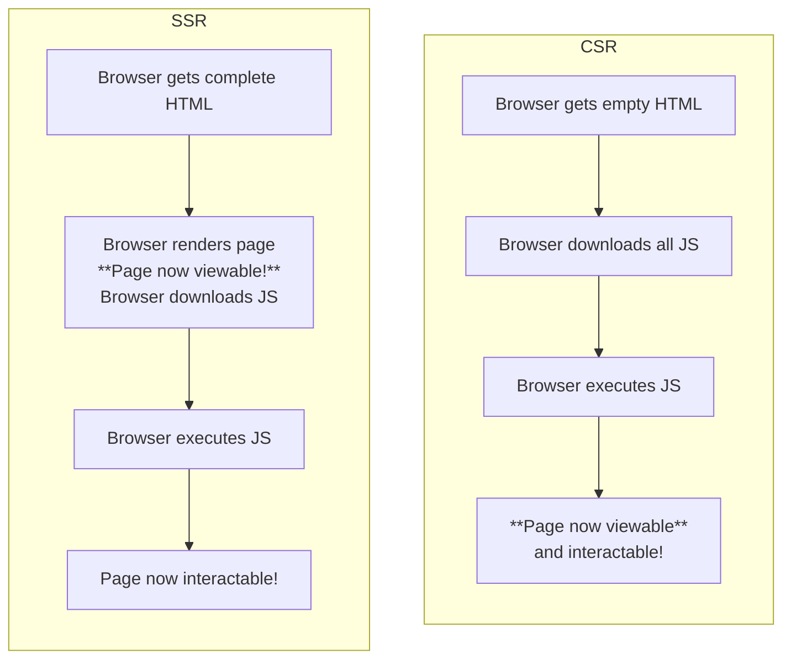

# CSR, SSR, Next.js

> **🚀TLDR**:
>
> - CSR: 서버에서 자바스크립트 파일만 연결된 빈 HTML 파일을 준다. 브라우저는 HTML을 파싱하면서 전체 애플리케이션에 필요한 번들링된 자바스크립트 파일을 모두 다운로드 받은 후에야 첫 화면을 렌더링한다.
> - SSR: 서버에서 요청 페이지에 대한 데이터가 완성된 HTML 파일을 준다. 브라우저는 서버에서 준 HTML을 바로 파싱하면서 렌더링한다.

- CSR과 SSR을 구분하는 방법
  - 브라우저에서 실제로 보이는 화면을 어디서 최종적으로 만들어서 보여주는지, 어떻게 만드는지에 따라 CSR과 SSR이 나눠지게 됩니다.

## 비교

<!-- prettier-ignore-start -->
| 구분 | CSR | SSR |
| :--- | :--- | :--- | 
| 원리 | 브라우저는 서버로부터 자바스크립트만 연결된, 데이터가 빈 HTML을 받아옵니다. HTML에 연결된 자바스크립트 파일이 모두 로드되면 자바스크립트가 동적으로 DOM을 완성하여 화면을 그립니다. | 브라우저는 서버로부터 완전하게 만들어진 HTML을 받아옵니다. 다 만들어진 HTML을 렌더링하여 화면을 그립니다. |
| 차이 | <li>첫 페이지 로딩 속도가 느립니다. 첫 페이지에 진입할 때 첫 페이지에 필요한 소스코드뿐만 아니라 당장 사용하지 않을 모든 소스코드까지 미리 받아와야 하기 때문입니다. 사이트의 크기가 커질수록 최초 페이지 로딩은 더 느려집니다. 코드 스플리팅(code spliting)으로 어느 정도는 해결가능하지만 완전하지는 않습니다.</li> <li>SEO가 불리합니다. 검색 엔진이 크롤링을 할 때 서버에서 처음 받아온 파일은 데이터가 비어있는 HTML이기 때문입니다. 구글에서는 SPA 앱에 대한 SEO를 제공하기는 하지만 그렇지 못한 검색 엔진도 많아서 문제가 됩니다.</li> | <li>첫 페이지 로딩 속도가 빠릅니다. 첫 페이지에 진입할 때 요청 받은 첫 페이지만 받아오기 때문입니다.</li> <li>SEO가 유리합니다. 검색엔진이 크롤링을 할 때 서버에서 처음 받아온 파일이 데이터가 꽉 차 있는 HTML이기 때문입니다.</li> |
| 차이 | <li>화면 전환이 부드럽고 빠릅니다. 애플리케이션에 필요한 모든 자바스크립트를 로딩하고 나면 그때부터는 동적으로 빠르게 렌더링하기 때문입니다.</li> <li>서버에 요청할 줄어들어 서버 입장에서는 부담이 줄어듭니다. 브라우저가 필요한 파일 대부분을 서버 입장에서는 초기에 한번만 내려주면 되기 때문입니다.</li> | <li>화면 전환에 깜빡임이 있습니다. 브라우저가 페이지를 그리려면 서버에 매번 요청해서 응답으로 받아온 새로운 HTML을 새로 그려야 하기 때문입니다.</li> <li>서버 요청 횟수가 증가하므로 서버 입장에서는 부담이 커집니다.</li>  |
<!-- prettier-ignore-end -->
